# SSU_helper_bot
Привет! Этот чат-бот создан для того, чтобы помочь вам в ответах на часто задаваемые вопросы. Ниже вы найдете инструкцию по его использованию и примеры вопросов, на которые он может ответить.

Бот поддерживает графическое меню и текстовые команды. Графическое меню появляется при первом обращении к боту при нажатии на кнопку “Старт” (синоним команды /start). При дальнейшей работе с ботом меню может быть свернуто. 

После этого Вы можете задавать боту текстовые вопросы, на которые он будет давать ответы. Для этого просто напишите ваше сообщение в чат, и бот ответит вам в течение нескольких секунд. Чтобы получить наиболее точный ответ, постарайтесь формулировать вопросы конкретно и понятно. Если вы не знаете, как точно сформулировать вопрос, попробуйте использовать ключевые слова, например: "расписание", "стипендия", "общежитие".

Чат-бот может помочь Вам в решении следующих вопросов:

1. Информация про общежитие
1. Получение различных справок
1. Расписание групп и преподавателей
1. Расположение корпусов
1. Графики учебных процессов
1. Прохождение военной кафедры
1. Информация об оплате обучения
1. Информация о пересдачах
1. Информация о получении стипендии
1. Новости института

После этого Вы можете задавать боту текстовые вопросы, на которые он будет давать ответы. Чат-бот может помочь Вам в решении следующих вопросов:

- **Информация про общежитие**
  - "Какие документы нужны для заселения в общежитие?"
  - "Какие правила проживания в общежитии?"
- **Получение различных справок**
  - "Как получить справку об обучении?"
  - "Что нужно для справки-вызов?"
- **Расписание групп и преподавателей**
  - "Какое расписание у 411 группы?"
  - "Расписание 241"
- **Расположение корпусов**
  - "Где находится корпус №3?"
  - "Как пройти к спортивному залу?"
- **Графики учебных процессов**
  - "Когда начинается зимний семестр"
  - "Когда каникулы у 1 курса?"
- **Прохождение военной кафедры**
  - "Какие документы нужны для военной кафедры?"
  - "Когда проходит обучение на военной кафедре?"
- **Информация об оплате обучения**
  - "Как оплатить обучение?"
  - "Какие способы оплаты доступны?"
- **Информация о пересдачах**
  - "Когда можно пересдать экзамен?"
  - "Какие исправить оценку?"
- **Информация о получении стипендии**
  - "Какие стипендии доступны студентам?"
  - "Что нужно для получения стипендии?"
- **Новости института**
  - "Какие мероприятия планируются на этой неделе?"
  - "Где можно найти последние новости института?"

Надеемся, что наш чат-бот станет вашим надежным помощником и облегчит ваше обучение и жизнь в университете. Если у вас есть предложения по улучшению работы бота, пожалуйста, сообщите нам!

Удачи в учебе!
# База данных

`	`База данных реализована с помощью SQLite, база данных хранится на сервере вместе с основными исполняемыми файлами проекта, в виде файла questions.db.

`	`Для создания базы и основных таблиц используется следующий код:

|
DATABASE\_NAME = 'questions.db'

def create\_tables():

`    `conn = sqlite3.connect("/home/dev-bot/ssu\_project/scripts/" + DATABASE\_NAME)

`    `cursor = conn.cursor()

`    `cursor.execute('''

`    `CREATE TABLE IF NOT EXISTS questions (

`        `id INTEGER PRIMARY KEY AUTOINCREMENT,

`        `user\_id INTEGER,

`        `question TEXT,

`        `label INTEGER,

`        `used INTEGER DEFAULT 0,

`        `timestamp DATETIME DEFAULT CURRENT\_TIMESTAMP

`    `)

`    `''')

`    `cursor.execute('''

`    `CREATE TABLE IF NOT EXISTS unclassified\_questions (

`        `id INTEGER PRIMARY KEY AUTOINCREMENT,

`        `user\_id INTEGER,

`        `question TEXT,

`        `timestamp DATETIME DEFAULT CURRENT\_TIMESTAMP

`    `)

`    `''')

`    `cursor.execute('''

`    `CREATE TABLE IF NOT EXISTS model\_accuracy (

`        `id INTEGER PRIMARY KEY AUTOINCREMENT,

`        `accuracy REAL,

`        `timestamp DATETIME DEFAULT CURRENT\_TIMESTAMP

`    `)

`    `''')

`    `conn.commit()

`    `conn.close()
|
| :- |

База данных имеет три основные таблицы, это model\_accuracy, для хранения лучшей метрики accuracy для сравнения после дообучения модели, таблицу questions, для вопросов используемых при дообучении, а также unclassified\_questions, для вопросов, которые не получилось классифицировать вообще.

|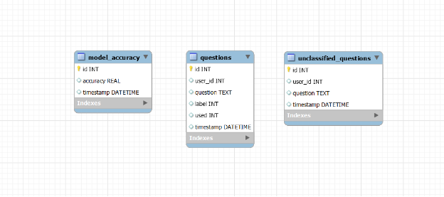|
| :- |
|Рис 1 Структура базы данных|

`	`Помимо основных полей, таких как id пользователя, дата и время добавления, есть поля label и used, поле label используется для обозначения класса, к которому принадлежит сообщение, поле used используется чтобы помечать вопросы, которые уже были использованы при дообучении (в том случае, если модель показала метрику accuracy больше чем максимальная)

`	`Для смены флага used используется следующая функция:

|
def mark\_as\_used():

`    `conn = sqlite3.connect("/home/dev-bot/ssu\_project/scripts/" + DATABASE\_NAME)

`    `cursor = conn.cursor()

`    `cursor.execute('''

`    `UPDATE questions SET used = 1 WHERE used = 0

`    `''')

`    `conn.commit()

`    `conn.close()
|
| :- |

`	`Для работы с базой данных были описаны функции добавления новых записей и т.д.

|
def add\_question(user\_id, question, label):

`    `conn = sqlite3.connect("/home/dev-bot/ssu\_project/scripts/" + DATABASE\_NAME)

`    `cursor = conn.cursor()

`    `cursor.execute('''

`    `INSERT INTO questions (user\_id, question, label, used)

`    `VALUES (?, ?, ?, 0)

`    `''', (user\_id, question, label))

`    `conn.commit()

`    `conn.close()

def add\_unclassified\_question(user\_id, question):

`    `conn = sqlite3.connect("/home/dev-bot/ssu\_project/scripts/" + DATABASE\_NAME)

`    `cursor = conn.cursor()

`    `cursor.execute('''

`    `INSERT INTO unclassified\_questions (user\_id, question)

`    `VALUES (?, ?)

`    `''', (user\_id, question))

`    `conn.commit()

`    `conn.close()

def add\_model\_accuracy(accuracy):

`    `conn = sqlite3.connect("/home/dev-bot/ssu\_project/scripts/" + DATABASE\_NAME)

`    `cursor = conn.cursor()

`    `cursor.execute('''

`    `INSERT INTO model\_accuracy (accuracy)

`    `VALUES (?)

`    `''', (accuracy,))

`    `conn.commit()

`    `conn.close()

def get\_best\_accuracy():

`    `conn = sqlite3.connect("/home/dev-bot/ssu\_project/scripts/" + DATABASE\_NAME)

`    `cursor = conn.cursor()

`    `cursor.execute('''

`    `SELECT MAX(accuracy) FROM model\_accuracy

`    `''')

`    `result = cursor.fetchone()

`    `conn.close()

`    `return result[0] if result[0] is not None else 0.0
|
| :- |

`	`Используя SQL запросы и встроенную библиотеку Python sqlite3, идет подключение к базе данных в директории виртуальной машины, далее путем запросов извлекаются или помещаются новые данные.

`	`Для дообучения модели из таблицы questions извлекаются вопросы, которые не были ранее использованы, то есть с флагом used = 0. Ниже представлен код для считывания соответствующих записей из базы данных.

|
def check\_new\_data():

`    `conn = sqlite3.connect('/home/dev-bot/ssu\_project/scripts/questions.db')

`    `cursor = conn.cursor()

`    `cursor.execute('''

`    `SELECT COUNT(\*) FROM questions WHERE used = 0 GROUP BY label HAVING COUNT(\*) >= 10

`    `''')

`    `result = cursor.fetchall()

`    `conn.close()

`    `return len(result) > 0
|
| :- |

|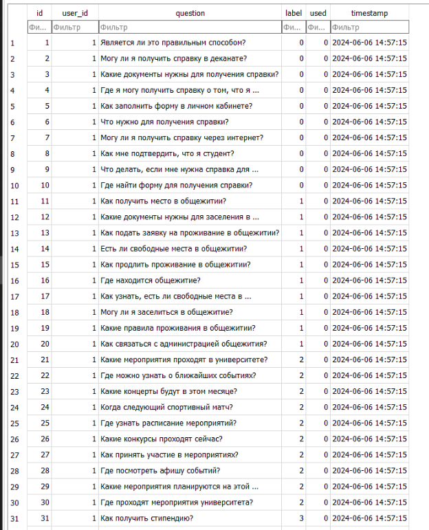|
| :- |
|Рис 2. Пример данных из таблицы questions|

|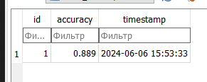|
| :- |
|Рис 3 Пример данных из таблицы model\_accuracy|

|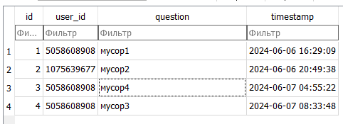|
| :- |
|Рис 4 Пример данных из таблицы unclassified\_questions|

|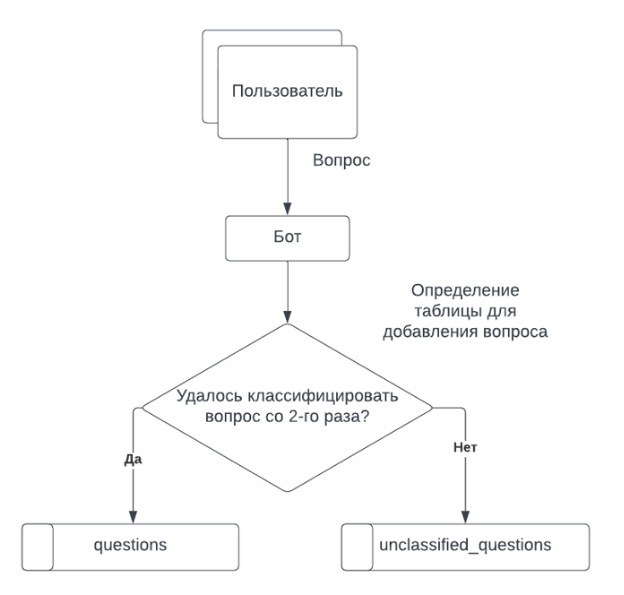|
| :- |
|Рис 5 Схема потоков данных в системе бота|

|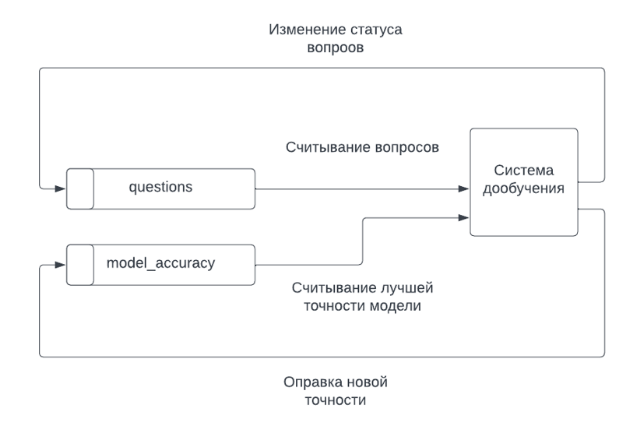|
| :- |
|Рис 6 Схема потоков данных в системе дообучения|

`	`Это DFD диаграммы в IDFE3 нотации.
# Сервер

После окончания разработки бота, было принято решение разместить его на виртуальной машине. На сервисе cloud.ru был арендован сервер с публичным ip на месяц. 

После настройки конфигурации сервера (рис 1) был сгенерирован ssh-ключ с помощью программы PuttyGen (рис 2), для упрощения процесса подключения к серверу.

|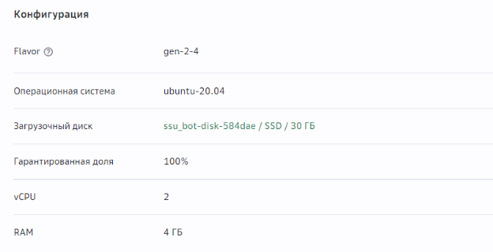|
| :- |
|Рисунок 1 конфигурация сервера|

|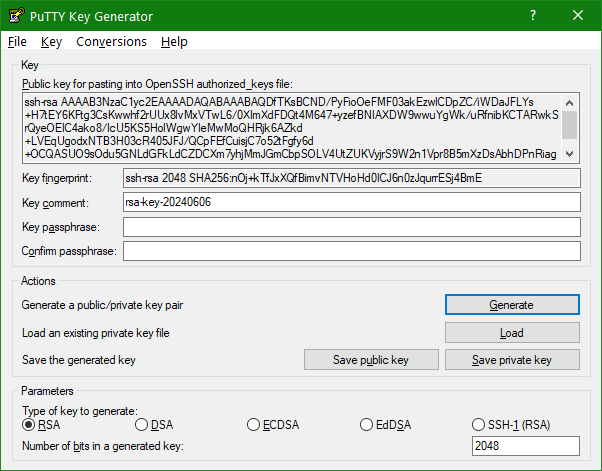|
| :- |
|Рис 2 Генерация ssh ключа для сервера.|

Имя пользователя задано как “dev-bot”, теперь для подключения к серверу через приложение Putty, достаточно ввести ip и сгенерированный секретный ключ для подключения, программа сохранит данные и позволит подключаться к серверу без ввода пароля (рис 3).

|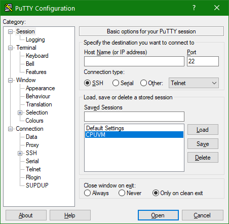|
| :- |
|Рис 3. Интерфейс программы Putty.|

Для авторизации на сервере будет использоваться выбранное имя (рис 4) после его ввода, можно пользоваться операционной системой Linux на сервере.

|

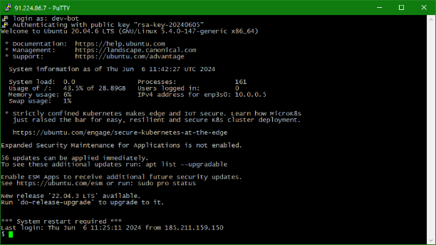
|
| :- |
|Рис 4. Авторизация на сервере|

**Настройка системы**

После успешной авториазации на сервере, необходимо настроить окружение и создать директорию для хранения исполняемого кода чат-бота.

В первую очередь была создана директория “ssu\_project”, с помощью команды mkdir /home/dev-bot/ssu\_project/

Далее необходимо установить пакеты python и pip, для компиляции кода и установки библиотек соответственно (рис 5).

|
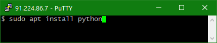

|
| :- |
|Рис 5 Установка python и pip|

`	`Для корректной работы с python, необходимо создать python окружение с помощью venv (Рис 6)

|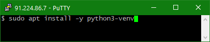|
| :- |
|Рис 6 Установка venv|

Далее в директории проекта создается окружение (рис 7), в качестве имени окружения было выбрано venv.

|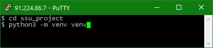|
| :- |
|Рис 7 создание окружения python|

**Загрузка файлов проекта**

Для загрузки файлов проекта использовалась утилита pscp которая была установлена вместе с программой Putty и доступа из командной строки Windows, с ее помощью можно отправлять/получать данные с сервера.

Шаблон команды для загрузки файлов: 

pscp FILE\_PATH USER@IP\_ADDRESS:/PATH/FILE

Где:

- FILE\_PATH – Путь до файла на локальной машине,
- USER – имя пользователя на сервере
- IP\_ADDRESS – публичный ip адрес сервера
- /PATH/FILE – путь для сохранения файла на сервере.

Все файлы проекта были помещены в zip архив, и отправлены на сервер с использованием pscp (рис 8).

|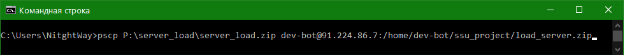|
| :- |
|Рис 8 Загрузка файлов проекта на сервер.|

После загрузки и распаковки архива на сервер была получена следующая структура (рис 9)

|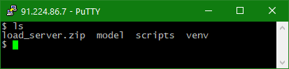|
| :- |
|Рис 9 Содержимое папки ssu\_projects.|

`	`В папке scripts находятся исполняемые файлы проекта, в папке model, модель Bert для классификации сообщений, venv – директория с виртуальным окружением python.

`	`**Установка библиотек**
**
`	`Для установки библиотек, сгенерирован файл requirements.txt (рис 10), для установки всех сторонних пакетов для корректной работы проекта использована команда pip install –r requirements.txt.

|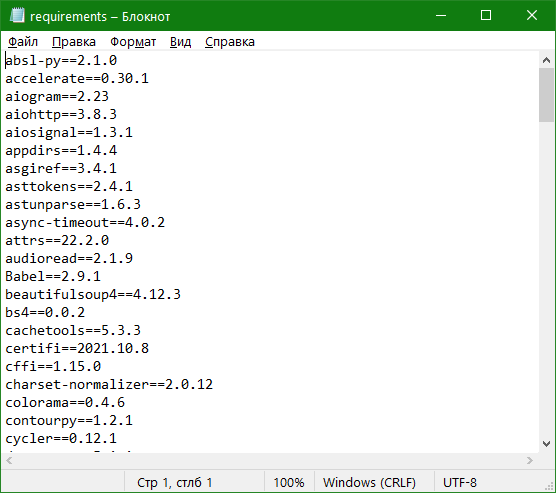|
| :- |
|Рис 10. Содержимое файла requirements.|

`	`После установки необходимо настроить запуск скрипта check\_and\_fine\_tune.py по расписанию.

`	`Это можно сделать с помощью утилиты crontab. После вызова команды crontab –e, открывается окно с редактором задач (рис 11), для того, чтобы скрипт выполнялся кажые 24 часа в полночь необходимо написать команду:

0 0 \* \* \* /home/dev-bot/ssu\_project/venv/bin/python/home/dev-bot/ssu\_project/scripts/check\_and\_fine\_tune.py >> /home/dev-bot/ssu\_project/fine\_tune.log 2>&1 

|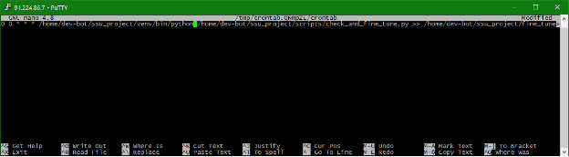|
| :- |
|Рис. 11 окно редактирования задач crontab|

`	`Далее необходимо запустить скрипт main.py отвечающий за логику работы бота. Сначала необходимо активировать окружение используя команду . venv/bin/activate (точка тоже часть команды), и далее используя утилиту nohub позволяющая сделать процесс фоновым, то есть даже при закрытии программы Putty, процесс main.py не завершится (рис 12.).

|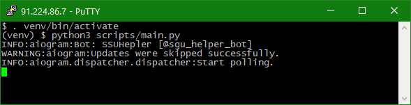|
| :- |
|Рис 12. Активация окружения и запуск бота.|

